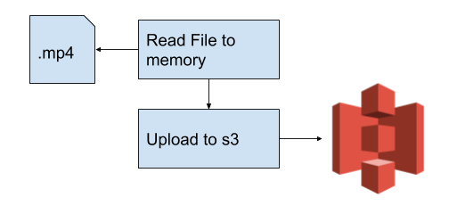
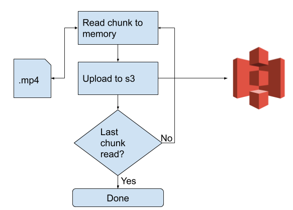
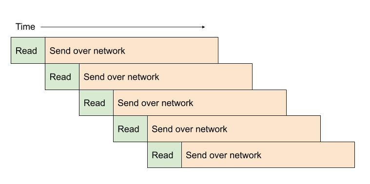

## I will never forget the first time I killed the music in a local coffee shop.
Struggling to teach myself "machine learning", I decided to download large dataset from the internet. As is typical with these types of workloads, the download size was well over 100 GB.
When I clicked download, Google Drive split the file into several chunks available to download simultaneously.

The competing music streaming device yeilded immediately, and acoustic pop covers were replaced with [4'33"](https://en.wikipedia.org/wiki/4%E2%80%B233%E2%80%B3) on repeat until I realized what I'd done.

I think that browsers are actually polite by default. If we begin a single download of a file, the download code doesn't try to use up all of the bandwidth and will likely only download one part at a time. This is what allows the network to live in harmony, with multiple people able to download what they need at a reasonable speed.
This Drive download acted differently and it felt sort of powerful.

## Bandwidth

The Media & Entertainment Industry struggles with a similar problem with large files. The original formats of files from the camera will typically exceed hundreds of Gigabytes. To cope with the long transfer times, a proprietary industry standard tool, Aspera, has been the de facto leader. Aspera uses a custom protocol (FASP) to transfer files and uses a browser plugin to implement the protocol.

Aspera is brilliant [^1]. The user can manually alter their upload speed and quickly meet the constraints of their hardware.

Recently, Aspera added integrations with cloud object storage, such as s3. But I wonder if this misses the point. Object storage **is** a service in front of storage already. Can we push these existing servers to their limit with coffee shop buckling magic?

## A sink
The general reason we want to transfer large assets to a centralized location is that the source created something valuable. The sensor on the camera shooting Selling Sunset in 4K produces, for now, uniquely valuable information. Reams of sensor data must be shipped back to home base for post prodcution to be around computers that can handle the job.

Starting out, this is how it can be done.

This is fairly straightforward.

## And a wait
The problem makes itself apparent when the source size exceeds memory capacity. What happens when the file is 15 times larger than your memory capacity? To get around this we leave the rest of the file on disk and only read one chunk at a time and send it.
Scale up the file to 400 GB. Libraries usually reccomend a chunk size. This chunk size is often less than 100 MB. For each request, it comes in phases that will often look like this drawing:

Standard chunked upload of a file.

When dealing with this type of web request, the typical loop looks like this in a straightforward loop.

You can see that stacking multiple requests can add up over time. Come to think of it, is there really a strict dependency on the last web request finishing from s3? If the target can handle it, we shouldn't care either. Let's get something going like this:

Quite literally, 7 requests can happen in the time of two requests. The tradeoff is that we are a bit rude on the network and hog our own networking card for resources. If no constraints are in place we could very well use up all of the bandwidth.

The power is in the ability to wait for multiple chunks to complete at the same time.

## Not Magic
Can we just keep lobbing chunks at the network until it is saturated? Well not quite. Yet again we run into memory constraints. Each of those chunks may require a retry, and in order to do so I hold on to the buffer in memory.

This introduces a slew of other problems. To demonstrate the complexity we take on, I will put off the buffering mechanism to another post.

To get a look at the code you can find it [here](https://github.com/nickdnickd/botnica).

[^1]: That's not say Aspera didn't have its own quirks in the field. In atypical network environments for documentary filmmakers, we saw issues particularly within univerisity networks. And it is pretty expensive. On top of the current infrastructure, it costs about $1 USD per GB transferred in their SaaS offering. Under enough load these Faspex servers would also go down.