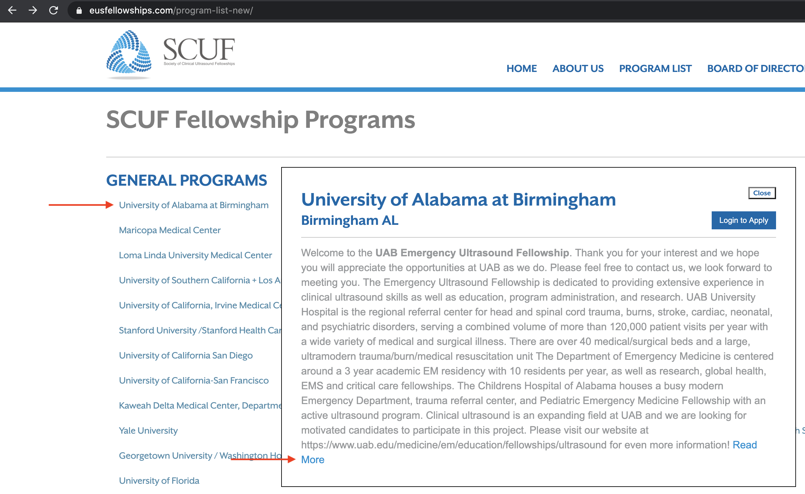
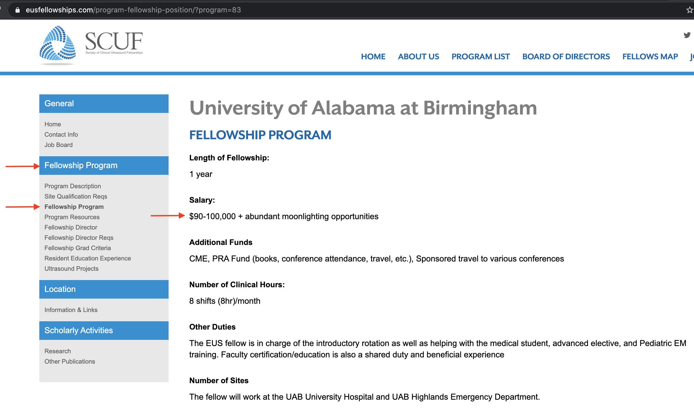
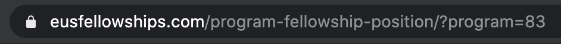
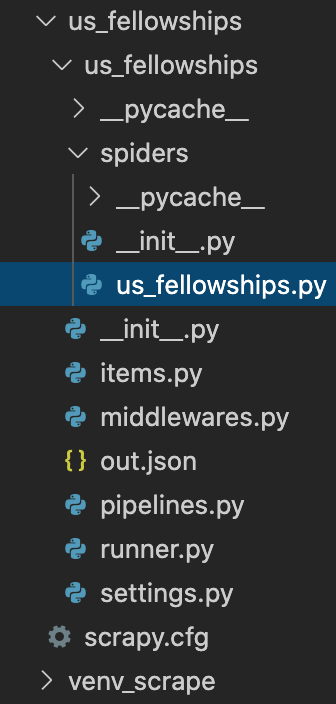
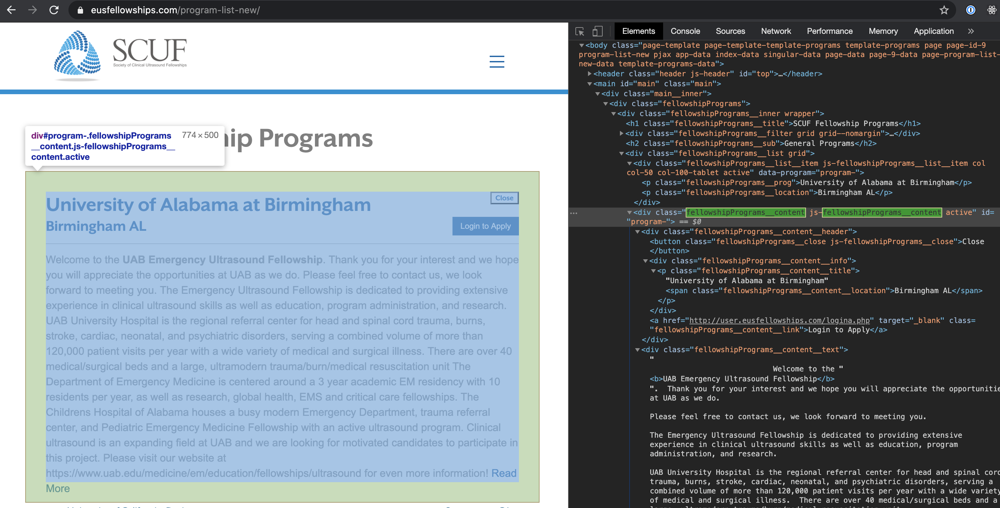

## Interview Season

Doctors have it rough. After graduating medical school, they enter a period of indentured servitude known as _residency_. It is not uncommon to hear of over 80 hour weeks, 12 hour shifts and DOMA's. DOMA stands for "Day Off, My Ass" which describes the period of time between a night shift, letting out at 7am, and a day shift starting at 7am. Technically 24 hours, but most of it is spent asleep. In between these brutal shifts, a resident very near and dear to my heart has begun interviewing for a fellowship. A fellowship is a brief extension to residency that allows a doctor to focus on a specific area within their field of medicine. One example is ultrasound. This is a rapidly developing subspecialty of emergency medicine because it provides a quick, noninvasive view of a patient's internal state. 

Throughout the country there are over 100 ultrasound fellowship programs, all vying for candidates on [this website](https://eusfellowships.com/). I have visited this site over 100 times to help my SO compare and contrast.
It's not the most beautiful website, but it gets the job done. One can tell that the data are organize in some sort of database behind the scenes and uses PHP (something I know nothing about). However, the site's frontend takes the form of a tree-like structure with different characteristics nested in links on the side pane.

## The boring way
Say I want to compare the salaries of 20 different programs. To view all of the programs, you have to go to [/program-list-new](https://eusfellowships.com/program-list-new/). Once there you must click on a program, then click **Read More**.




We are then met with the program page. Once there, on the left pane, under Fellowship Program header, click the Fellowship Program link.





Here we have the salary- now enter this in a spreadsheet and do the other 20. You know what? Add Location, Year Founded (age matters here), Salary, Hours, Benefits, Number of Sites, Do they Bill for Ultrasounds? Are the Moonlight opportunites?, etc. Under the **Fellowship Program** header on the left, both the Program Description and Fellowship Program links for each program contain all of this information, so I'll see you in a few hours.


## No thank you

Wait a second... check out the url bar. 



The portion after the question mark is known as a _query parameter_. This `program=83` is a hint to me that our browsers are querying the website for different programs by id. Also the fact that the id for this program is a simple integer, as opposed some random [uuid](https://en.wikipedia.org/wiki/Universally_unique_identifier) like `10d15da5-6cea-4bd8-814d-e9653b29a7d3`, suggests that programs have monitonically increasing id's (1, 2, 3, etc). Clicking around other sites has confirmed this.

Can I stubbornly avoid clicking through these links and run something that will crawl through all program pages? Can I spend 4 hours learning something new that might have just taken 2 hours to do?


## Forget Gritty, are you Scrapy?

When thinking about web crawlers, I originially thought they'd just be a light python library that I would just include and run on a base url.
What I was met with was an entire platform for running distributed web crawlers called [scrapy](https://docs.scrapy.org/en/latest/intro/overview.html).

Following along with the [tutorial](https://docs.scrapy.org/en/latest/intro/tutorial.html), we make our tweaks along the way.

### Step 0, create a virtual python environment and install scrapy

We do this to keep the global python environment clean. Dependencies can get tangled up with version numbers. Check [this](https://realpython.com/python-virtual-environments-a-primer/) out for a fantastic primer.

`python3 -m venv venv_scrapy`

`source venv_scrapy/bin/activate`

`pip install Scrapy`


### Step 1, create a project

`scrapy startproject usfellowships`

### Step 2, check out the structure

A directory layout and boiler play file appear as follows:



I've highlighted `spiders/us_fellowships.py` because this "spider" is where most of our code goes.

Let's dive into the structure and code

## Step 4, our spider

### Spider file setup

These are the global constants and libraries pull in to set up the spider.
It was here where I declare the start and end to the program id's. No id goes above 150 and when we find an empty page, skip over that.
`position_headers` is a dictionary for us to translate the headers inside the webpage into more consise data columns. 

```python
import scrapy
from urllib.parse import urlparse

START_RANGE = 1
END_RANGE = 150

position_headers = {
    "Salary": "salary",
    "Number of Clinical Hours": "hours",
    "Number of Sites": "sites",
    "Year Fellowship Started": "founded",
    "Do you bill for ultrasounds?": "bill",
    "Do you require follow up imaging for patients who get ultrasounds?": "follow_up",
}
```

### Spider class and attribute definition

Our Spiders are a child class of base class `python scrapy.Spider`. The key attribute here is `start_urls`. I use this list to declare all of the program descriptions I will walk through, including the overall list which gives us location and id to name mapping.

``` python
class UltrasoundSpider(scrapy.Spider):
    name = "us_fellowships"
    allowed_domains = ["eusfellowships.com"]
    start_urls = (
        [
            f"https://eusfellowships.com/program-fellowship-position/?program={program_number}"
            for program_number in range(START_RANGE, END_RANGE)
        ]
        + [
            f"https://eusfellowships.com/program-description/?program={program_number}"
            for program_number in range(START_RANGE, END_RANGE)
        ]
        + ["https://eusfellowships.com/program-list-new/"]
    )
```


### The Parse function

There are three types of url in our scenario: program list, program description, and fellowship position. For ease of use, each type of webpage has an id as well as the kind of information on that page. For example, the program list contains all of the program titles and locations.

```python
    def parse(self, response):

        current_url = urlparse(response.url)
```

#### Parse program list for information

The program list convienently contains all of the program id's, titles and locations with currently active ultrasound programs. The key question to me was "what is the actual container of information on this site?". Looking closer at the structure, we have to dig into the html elements of the website using Developer Tools.

The spot that contains the location, program id and title for each program is the detail panel that appears when one clicks on a particular program.
With Developer tools open, click one of the links and hover around the header. You would see somethoing like the following:



Here we can see that the container of this information is `fellowshipPrograms__content` inside an html `<div>`. This class name is queried in scrapy with the `response.css()` method, which collects all of the elements matching the search term. The search term syntax is `html_element.css_classname`. Putting that together, our container of valuable information can be found with `programs_content = response.css("div.fellowshipPrograms__content")`

Once we have the content panel, we must query the children of the element for the actual text we need. Inside content, there is title. This is the program title that we want in our output. To get this string simply add `::text` to the query term of the html tag and call the `.get()` metho on the result. This content happens to be part of a paragraph element, `<p>`. The final query looks like `title = prog.css("p.fellowshipPrograms__content__title::text").get()`

Finally, `data_row` is the dictionary that holds information for each webpage we visit. It will return the data in the result `out.json` file.

```python
        # Get all programs list data
        if response.url == "https://eusfellowships.com/program-list-new/":
            programs_content = response.css("div.fellowshipPrograms__content")
            for prog in programs_content:
                data_row = {}
                title = prog.css("p.fellowshipPrograms__content__title::text").get()
                location = prog.css(
                    "span.fellowshipPrograms__content__location::text"
                ).get()
                program_id = prog.css("a.fellowshipPrograms__button").attrib["href"]
                data_row["program_id"] = program_id.split("program=")[-1]
                data_row["title"] = title
                data_row["location"] = location
                yield data_row

            return
```

#### Parse the description pages

And that's the essence of css-based web scraping. Apply this approach to the two other types of web pages and data_row will soon contain all of the useful information from the website.

```python
        # Step 0 - get program id
        program_id = current_url.query.split("=")[-1]
        print("program_id: ", program_id)

        # Step 1 - Get the title of the program
        program_main = response.css("div.programExtra__main")
        
        program_title = program_main.css("h2.programExtra__main__title::text").get()
        print(f"Title: {program_title}")
        program_content = program_main.css("div.programsExtra__main__content")

        if program_title:
            # print(f"Program Content: {program_content.get()}")
            program_headings = program_content.css(
                "h4.programsExtra__heading::text"
            ).getall()
            program_textareas_raw = program_content.css(
                "p.programsExtra__textarea"
            ).getall()

            program_textareas = []
            if not len(program_textareas_raw):
                program_textareas_raw = program_content.css(
                    "div.programsExtra__textarea"
                ).getall()
                for raw_textarea in program_textareas_raw:

                    program_textareas.append(
                        raw_textarea.replace(
                            '<div class="programsExtra__textarea">', ""
                        ).replace("</div>", "")
                    )
            else:
                program_textareas = [
                    raw_textarea.replace(
                        '<p class="programsExtra__textarea">', ""
                    ).replace("</p>", "").replace("<br>", " ").replace("&gt;", "")
                    for raw_textarea in program_textareas_raw
                ]

            data_row = {}
            data_row["program_id"] = program_id
            for heading, textarea in zip(program_headings, program_textareas):
                heading_clean = heading.strip(":")
                text_clean = textarea.strip("\t\n ")
                if heading := position_headers.get(heading_clean):
                    data_row[heading] = text_clean

            yield data_row

```

## Runner

This combines all of the information together in `runner.py` (see directory structure above).

```python
import os
from scrapy.cmdline import execute

os.chdir(os.path.dirname(os.path.realpath(__file__)))

try:
    execute(
        [
            'scrapy',
            'crawl',
            'us_fellowships',
            '-o',
            'out.json',
        ]
    )
except SystemExit:
    pass
```

Just run `python runner.py` and watch the machine churn.


## Results

Here is an except from `out.json` for id 53. 

```json
[
    {"program_id": "53", "salary": "$115,000", "hours": "660", "sites": "2"},
    {"program_id": "53", "founded": "2006", "bill": "yes", "follow_up": "no"},
    {"program_id": "53", "title": "Temple University", "location": "Philadelphia PA"}
]

```


Each type of web page yeiled different information.
In the end, it was easiest to parse process this file into a csv that contained a single row.

```
Program, Location, Founded, Salary, Hours, Benefits, Sites, Bill/FU Study?, Moonlight?
Temple University,Philadelphia PA,2006,"$115,000",660,,2,yes/no,,,
```